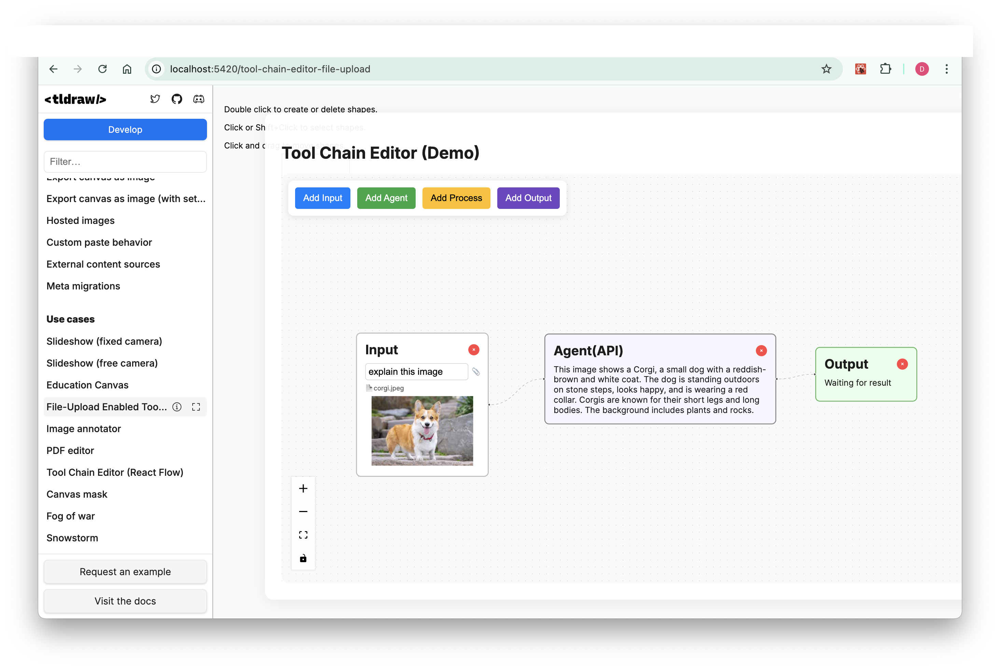

# Basic ToolChainEditor with File Upload Example

This example demonstrates how to integrate a react-flow based Tool Chain Editor within the tldraw canvas ecosystem (enhanced with File Upload).

## Features (original ToolChainEditor - refer to example @ /tool-chain-editor-original)
- Supports automatic rendering of tool chains (mock data)
- Nodes can be dragged and connected
- Node parameters can be edited by double-clicking
- ToolChainEditor as the main interaction, coexisting with canvas ecosystem
- Future integration with LLM-returned tool chain data

## Interaction Guide (original ToolChainEditor)
- Users can input queries to automatically generate tool chains (currently mock data)
- Nodes can be dragged, connected, and parameters edited by double-clicking
- Input flows through connections, with node outputs serving as inputs for the next node

## Features (File Upload)
- Upload a file (currently image file supported) by clicking on Attachment Icon in the Input Node
- Upload a file by drag-and-drop into Input Node

## Interaction Guide (File Upload)
- On the Attachment Icon Click inside Input Node box or Dragging an image file into the Input Node box, an image is added and analyzed via LLM call to OpenAI API.
- Hard-code your provider ('deepseek' for text-only and 'openai' for image or image+text) and api key inside 'callLLMUnified' function.

